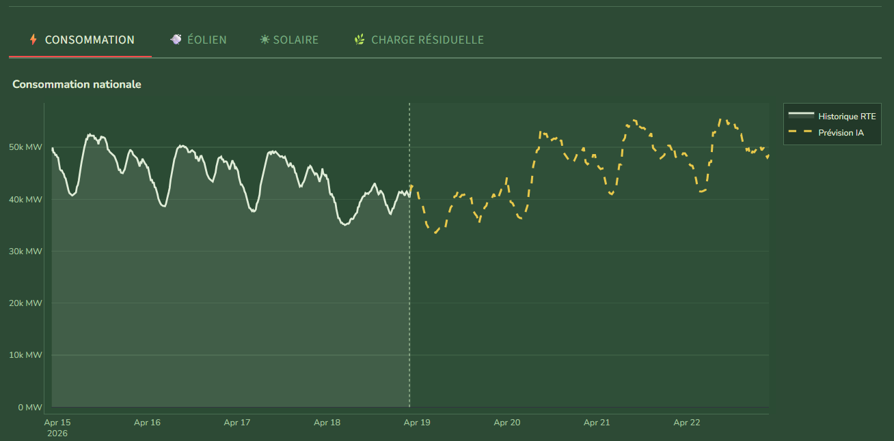
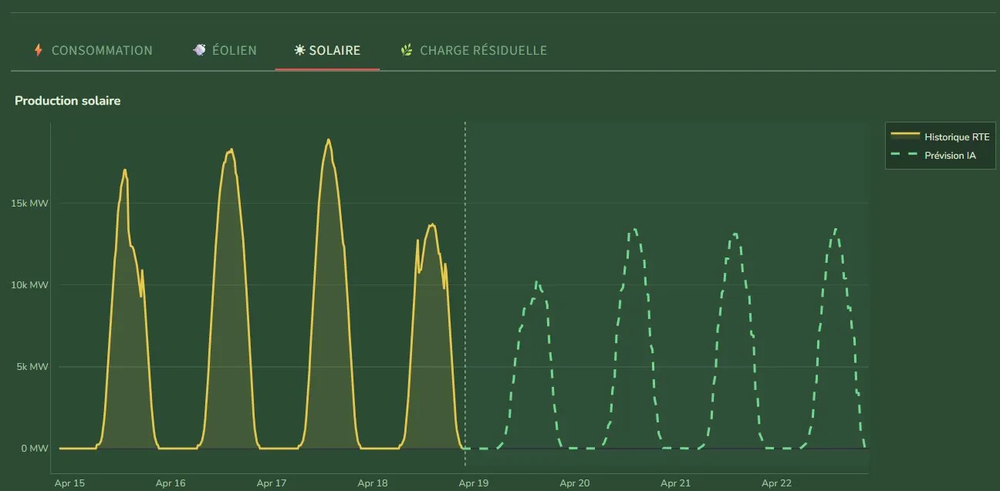
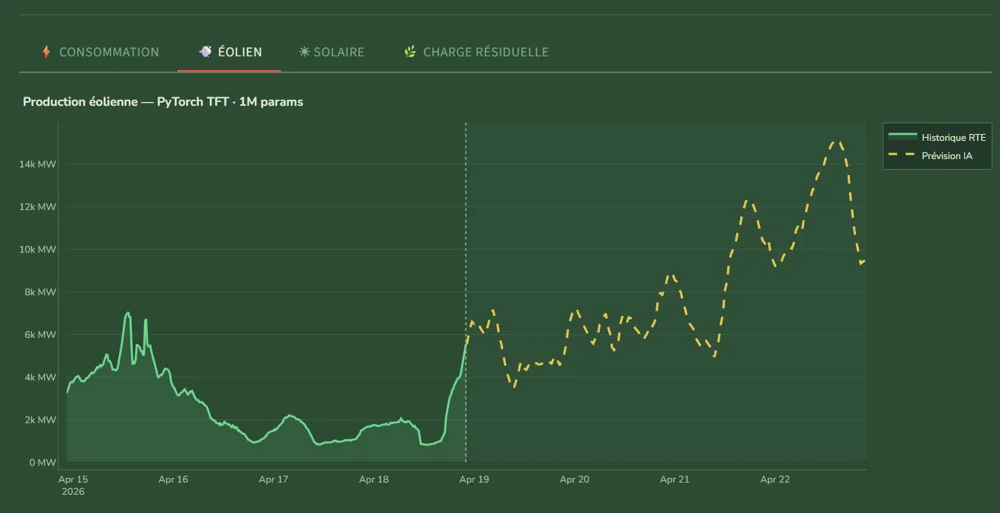

# Modeles-de-prediction-consommation-et-generation-electricite
# 🌿 Réseau Électrique · France

Application de prévision en temps réel du réseau électrique français — consommation nationale,
production éolienne, production solaire et charge résiduelle — alimentée par les données live RTE éCO2mix.

## Démo en ligne
👉 [modeles-de-prediction-consommation-generation-electricite-hk64.streamlit.app](https://modeles-de-prediction-consommation-generation-electricite-hk64.streamlit.app)

## Captures d'écran

---

## Modèles

### ⚡ Consommation — XGBoost
Entraîné sur les données historiques RTE (2015–2025) rééchantillonnées à 30 minutes.
Températures issues de l'API Open-Meteo archive (ERA5) pour l'entraînement, historical-forecast pour le test.

**Features :** heure, jour de la semaine, mois, jours fériés, température,
lags à H-24h / H-48h / H-168h, moyennes glissantes sur 24h et 168h.

---

### ☀️ Solaire — XGBoost v2
La cible est le **load factor** (normalisé 0–1 par rapport à la capacité installée de 21 GW),
reconverti en MW à l'inférence. Approche multi-zones sur 4 régions.

**Zones météo :** Nouvelle-Aquitaine, Occitanie, PACA, Auvergne-Rhône-Alpes

**Features par zone :** rayonnement global et direct, couverture nuageuse, température
+ encodages cycliques (heure, mois, jour de l'année), lag H-24h, moyenne glissante 24h

**Hyperparamètres :** n_estimators=1500, lr=0.03, max_depth=7, subsample=0.85, early stopping

**Performances :** MAE = 301 MW · RMSE = 619 MW

---

### 💨 Éolien — Temporal Fusion Transformer (PyTorch)
Modèle deep learning séquence-à-séquence. La cible est également un **load factor** (capacité = 25,5 GW).
Un callback `ForecastUncertaintyNoise` corrompt les covariables météo futures pendant l'entraînement
avec un bruit croissant linéairement avec l'horizon, simulant la dégradation réelle des prévisions.

**Architecture :** hidden_size=16 · attention_head_size=4 · dropout=0.1 · QuantileLoss
· fenêtre encodeur = 96 pas (48h) · horizon de prévision = 48 pas (24h)

**Zones météo (7) :** HDF Somme, HDF Aisne, Grand Est Marne, Grand Est Aube,
Occitanie Aude, Offshore Saint-Nazaire, Offshore Fécamp

**Features par zone :** vitesse du vent à 100m, direction, température, pression de surface,
courbe de puissance physique, correction densité de l'air

**Dataset :** hybride ERA5 (2014–2020) + API historical-forecast Open-Meteo (2021–2025)

**Performances :** MAE validation = 0,026 (load factor) · MAPE = 14,7%

> ⚠️ Le modèle éolien reste le moins stable des trois — l'éolien est intrinsèquement difficile
> à prévoir au-delà de quelques heures, et les résultats peuvent diverger sur des horizons longs.
> Travail en cours.

---

## Architecture & Cache
